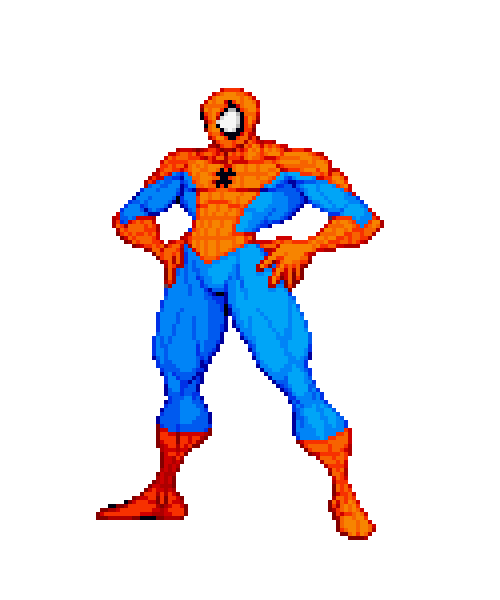
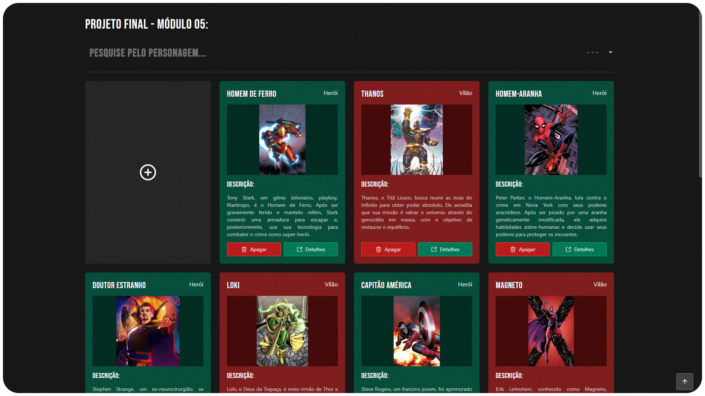
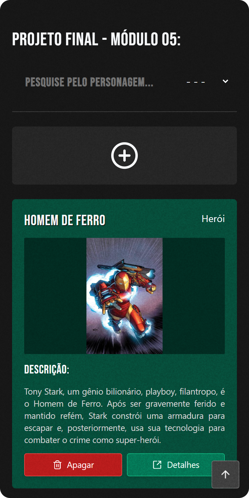

<p align="center"><p>
<h1 align="center">Módulo 05 - Projeto Final</h1>

<p align="center">
  <br>
  <a href="https://br-darkness.github.io/Ada.Tech_-_Projeto_Modulo_05/">LocalStorage Version</a>
  <br><br>
  <a href="https://projeto-heroes-ada.netlify.app/">Firebase Version</a>
</p>

<br>

<p align="center"><p>
<p align="center"><small><b>Imagem da tela inicial da versão de desktop - Projeto Final</b></small></p>

<br>

<p align="center"><p>
<p align="center"><small><b>Imagem da tela inicial da versão mobile - Projeto Final</b></small></p>

<br>

## 💡│Objetivo

>  Criar uma aplicação para cadastro de personagens da Marvel.

<br>

## ❓│Como rodar o projeto:

### 📦│Dependências do projeto:

> Ambas as versões do projeto foram construídas utilizando Vite e TypeScript sendo assim necessário de se instalar o [Node.js](https://nodejs.org/) versão 18 (ou superior) e utilizar o [vite 5.1](https://vitejs.dev/) (ou superior).

<br>

#### 💾│LocalStorage version:

```json
"dependencies": 
{
  "@radix-ui/react-dialog": "^1.0.5",
  "lucide-react": "^0.330.0",
  "react": "^18.2.0",
  "react-dom": "^18.2.0",
  "react-router-dom": "^6.22.0"
},
```

#### ☁│Firebase version:

```json
"dependencies": 
{
  "@radix-ui/react-dialog": "^1.0.5",
  "firebase": "^10.8.0",
  "lucide-react": "^0.330.0",
  "react": "^18.2.0",
  "react-dom": "^18.2.0",
  "react-router-dom": "^6.22.0"
},
```

<br>


### 💻│Iniciando o projeto

- Baixe ou clone o repositório.

- Abra o terminal na pasta e utilize o comando `npm run dev` para executar a aplicação.

- No navegador de internet acesse `localhost:` e o número da porta de rede que lhe foi informada. 

<br><hr>

<details>
  <summary>
    <h2>🤔│Requisitos do projeto: </h2>
  </summary>

    - Deve ter um formulário para inputar os seguintes dados:
    
      - Nome (Obrigatório)
    
      - Altura
    
      - Idade
    
      - Origem (Obrigatório)
    
      - Raça
    
      - Tipo (Obrigatório)
    
        - Herói
    
        - Vilão
    
      - Descrição (Obrigatório)
    
      - URL de uma imagem do personagem (Obrigatório)
    
    - Deve haver uma validação dos dados obrigatórios, se não tiver todos os dados obrigatórios, não salva.
    
    - Ao enviar os dados do formulário, deve exibir o card logo abaixo do formulário e limpar o formulário.
    
    - Deve ser possível adicionar vários cards, criando uma grid de cards logo abaixo do formulário.
    
    - Nessa grid de cards deve ser possível filtrar o personagem por `nome` ou por `tipo`.
    
    - Deve ser possível remover um card das grid.
    
    - Cada card deve mostrar os seguintes dados.
      - Nome
      - Imagem
      - Descrição
      - Botão "Ver detalhes"
      - Botão "Remover”
    
    - Ao clicar em "Ver detalhes” deve direcionar para outra rota que mostra todos os dados do personagem.

</details>

<hr><br>

## 📋│Integrantes do Grupo 05:

- Vitor Galindo de Oliveira

- João Lucas Mota

- Lucas Justino

- Victor Callegari

- Laiane